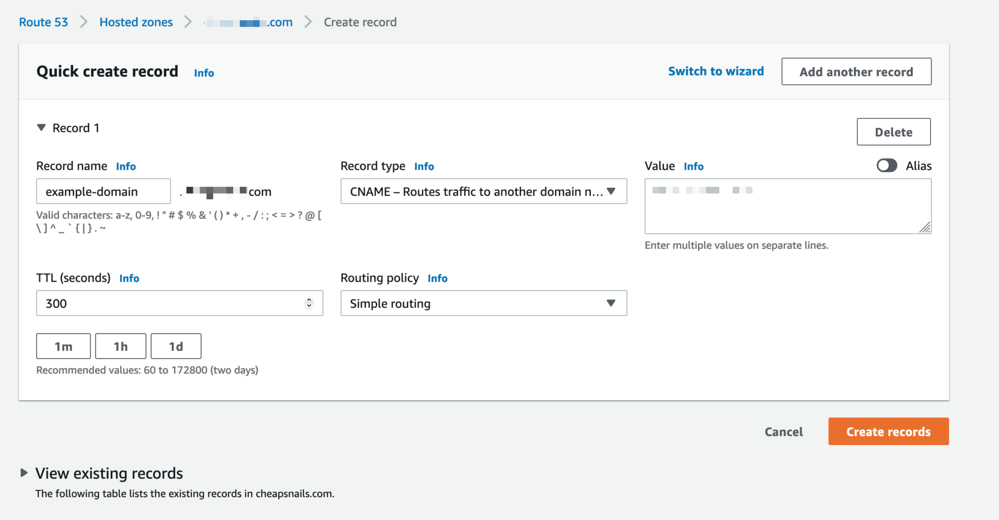
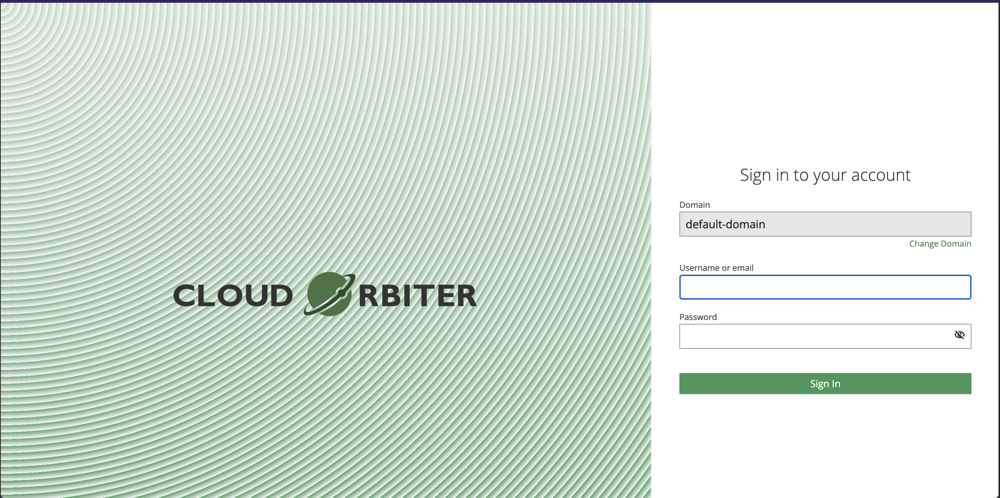

# Cloud Orbiter - AWS Marketplace
<!-- ABOUT THE PROJECT -->
In this document we will cover the deployment of Cloud Orbiter on AWS EKS. Here we are going to use a dual load balancer deployment, where the Frontend and the controller will exposed separately.

## Pre-requisites/Requirements:
1. Public EKS Cluster with outgoing internet connectivity from EKS (with minimum 4 vCPUs and 16GB RAM available)
2. At least one public subnet in your cluster VPC
3. Storage Class configured (gp2/gp3/or any other)
4. AWS Load Balancer Controller configured
5. Bidirectional Ports 443, 6443, 8030, 8040 open in EKS nodepool secgrp
8. Single TLS/SSL cert for Clour Orbiter public endpoint
9. Domain URLs for public endpoint
10. Github Access Token for cluster-manager service

## Installation

1. In your EKS cluster, create namespace compass and create a tls secret with your SSL/TLS certs
```
kubectl create ns compass
kubectl create secret tls domain-tls -n compass --cert=xyz_fullchain.crt --key=xyz_privkey.key
```

2. Modify below parameters in the below override values.yaml file accordingly. (Below parameter values are just an example)
```
global.domain: &compassDomain "console.xyz.com"
global.controllerDNSName: &controllerDomainName "console.xyz.com"
global.frontend.certs.external: "domain-tls"
clusterManager.github.token: "<github token with repo read access>"
```

3. Deploy the Helm Chart using below commands
```
helm pull oci://709825985650.dkr.ecr.us-east-1.amazonaws.com/coredge-io/orbiter-helm-chart --version 1.0.0
helm install -f <override-values-file> compass orbiter-helm-chart-1.0.0.tgz -n compass
```

4. Check the resources after installation. (Below pods must be running after successful installation)
```
kubectl get pod -n compass
``` 

5. Once installed, check the ```frontend``` and ```compass-controller``` service for following annotations. If not proper, add the following
```
annotations:
    service.beta.kubernetes.io/aws-load-balancer-type: external
    service.beta.kubernetes.io/aws-load-balancer-nlb-target-type: ip
    service.beta.kubernetes.io/aws-load-balancer-scheme: internet-facing
```

6. Make CNAME record in your DNS for the Cloud Orbiter endpoint accordingly (in our example - 'console.xyz.com'). 
If using Route53, see below screenshot to create a CNAME record. 

<p align="center">Landing Page</p>

Refer this guide to create a CNAME record [Creating CNAME record on Amazon Route53](https://docs.aws.amazon.com/Route53/latest/DeveloperGuide/resource-record-sets-creating.html)

Note: You can get the DNS name for the NLB assigned by executing the below command 
```
kubectl get svc frontend -n compass
```

7. Access the GUI using the Domain URL provided in Step 3. You should see landing page like below for Cloud Orbiter GUI.

<p align="center">Landing Page</p>


<p align="center">Login Page</p>

NOTE: Default Login creds for Cloud Orbiter. 
```
username: admin
password: Orbiter@123
```
Login creds can be modified by changing the ```controller.username``` & ```controller.password``` parameters !
    
NOTE: Deployment also creates a ```kubeguardian-server-ingress``` when ingress flag is enabled. This object is not being used and as the nginx reverse proxy/compass-api is handling the routes internally

For Cloud Orbiter user guides and documentation please refer [Cloud Orbiter Docs](https://docs.cloudorbiter.io/)

## Override Values File for Helm Deployment - 
Note: Make changes as needed in the below override values.yaml

```
global:
  # deployment environment indication for deployer to enable relevant
  # environment specific configuration, currentely only environment
  # supported is AWS
  # default value is empty string indicating no special requirements
  # for the environment
  environment: "AWS"

  # variable to indicate if environment has capability to handle
  # saas based capabilities, currently it enables following
  # allow each tenant to have its own separate DNS sub-domain
  # example tenant abc will be available at abc.<root-domain>
  # this requires the setup to be done with a wildcard certificate
  saas:
    enabled: false

  # Note: we do not program DNS server as part of this configuration
  # Set domain it indicate where the controller API is hosted, this
  # configuration is used to enable cross-origin and access security
  # unused in dev environment, while ingress is disabled
  domain: &compassDomain ""

  # Note: we do not program DNS server as part of this configuration
  # set the domain at which controller is providing infrastructure
  # connections, this is used to generate server and client SSL
  # certificates used for TLS/mTLS connection,
  # This is also auto populated in the agent manifest files to
  # indicate server endpoint where cluster needs to initiate connection
  # While using single load balancer deployment, use this same as
  # domain name
  controllerDNSName: &controllerDomainName ""

  # indicates usage of external ingress, currently also acts as a
  # switch to indicate use of domain configuration
  ingressEnabled: &compassIngressEnabled true

  # currently not used
  ingressClass: &compassIngressClass nginx

  # repository from where the controller images are pulled for
  # controller
  repository: &repository 709825985650.dkr.ecr.us-east-1.amazonaws.com/coredge-io

  # use build using the tag generated based on the date of deployment
  # this is relevant for enabling some of the CI/CD platforms
  UseDailyBuilds: &useDailyBuilds false

  # provides configuration of build tag to be used for container images
  ReleaseTag: &releaseTag v1.0

  # image pull policy to be used
  imagePullPolicy: &imagePolicy Always

  # storage class to use for persistent volumes, if empty fallback to
  # default storage class
  storageClass: &storageclass ""

  # external IP for controller, relevant, when controllerDNSName is not
  # configured to allow generation of server certificate validity using
  # this IP address
  externalIP: &controllerIP 127.0.0.1

  #Set this to true for environments without internet and update the proxy details
  proxy:
    enabled: false
    http_proxy: ""
    https_proxy: ""
    no_proxy: "localhost,127.0.0.1,cluster.local,.svc,.svc.cluster.local"

  frontend:
    certs:
      # provide name of the TLS secret object configured providing
      # certificates for frontend, this configuration is usually used
      # with in combination of cert-manager, which would allow
      # preiodically refreshing the CA issued certificates, before
      # thier expiry
      external: ""
    nodePort: 31200
    # For Production environment we require kyc status validation
    # However, for dev and test environments we should be able to skip
    # these validations
    # Setting skipKyc true will bypass this validation
    # Note: This configuration should not be used for Production env
    skipKyc: false

  kubectl:
    # supported but not recommended
    # this can be enabled only if frontend is running with ssl certs
    # with ingress enabled, with this configuration enabled,
    # generated kubectl config file will fallback to usage of TLS
    # connection with token for auth instead of mTLS
    # Usually required only for scenarios where TCP port availability
    # is limited and infrastructure admin cannot provide 6443 for mTLS
    # communication of Kubectl
    tokenAccess:
      enabled: false

  controller:
    mtls:
      # supported but not recommended
      # set this value to true to fallback to simple TLS communication
      # between compass controller and compass agent
      # this is usally required to save usage of an extra TCP port
      disabled: false

  # proxy protocol is used to enable tracking client's IP both for API
  # access by user and controller access by infrastructure components
  # this allow enabling capability of geoloaction tracking for users
  # and infrastructure components using thier public IP information
  proxyProtocol:
    enabled: false

  # observability feature on the platform is rendered using grafana
  # to enable observability set grafana enabled
  grafana:
    enabled: false

  # to enable and configure cloud manager module for the platform
  # that allows capability of interacting with multiple public clouds
  cloudManager:
    enabled: true

  # to enable and configure metering module for the platform that
  # allows capability for metering the resource usage
  metering:
    enabled: false

tenantManagement:
  # allow tenant management, providing capability to create multiple
  # tenants enabling multi-tenancy
  enabled: true

betaFeatures:
  # Note: Skip Documentation
  # allow deployment with beta features enabled, this will allow working
  # with features that are still under development, for which UX and
  # feature itself can be changed without prior notification
  # These features are not expected to be enabled in production
  # environment, and will not be supported.
  enabled: true

cluster:
  accessLogs:
    enabled: true

replicaCount:
  configDB: 1
  metricsDB: 1
  compassConfig: 1
  compassController: 1
  compassTerminal: 1
  clusterManager: 1

# enable cluster manager module, responsible for managing lifecycle of
# kubernetes clusters
clusterManager:
  enabled: true
  github:
    token: ""

# enable loading default repositories for better user experience with
# preconfigured helm repositories
defaultRepos:
  enabled: true

# url to enable marketPlace apps inside orbiter
marketPlace:
  url: ""

controller:
  # default user name for login
  username: admin
  # default password for login
  password: Orbiter@123

  firstname: 
  lastname: 
  email: 

```
